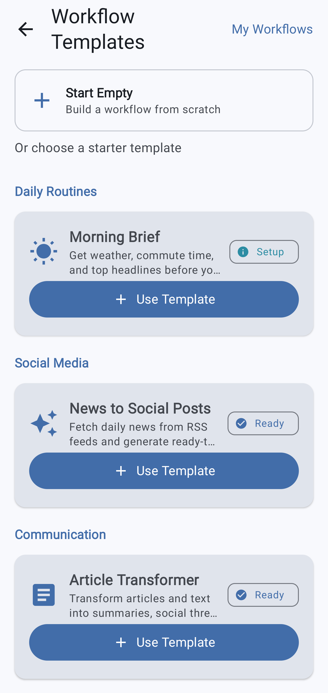
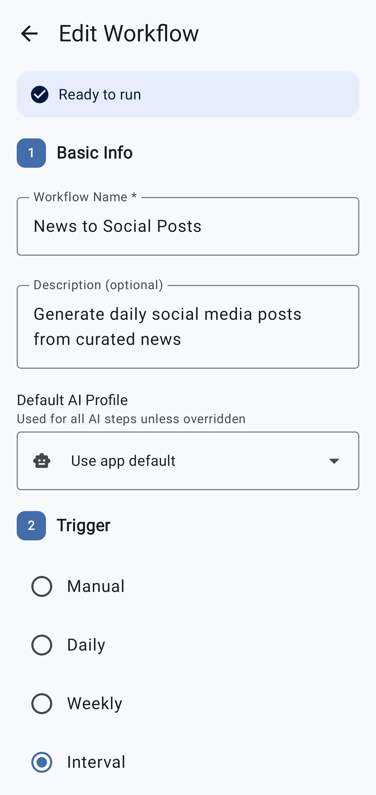
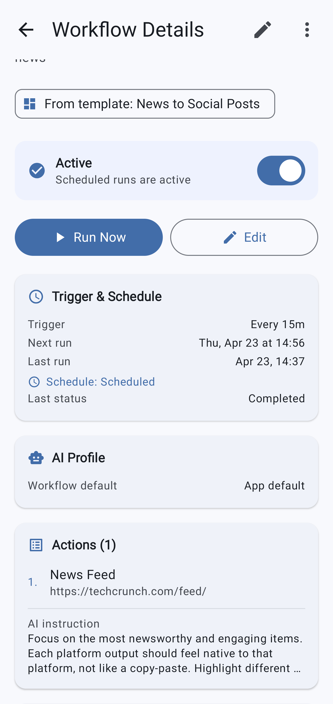
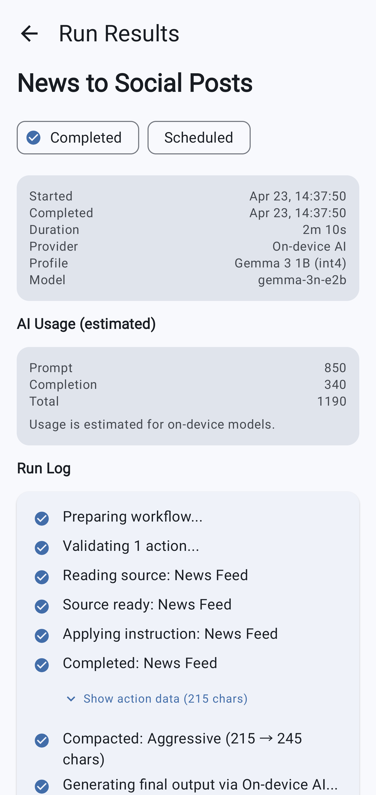
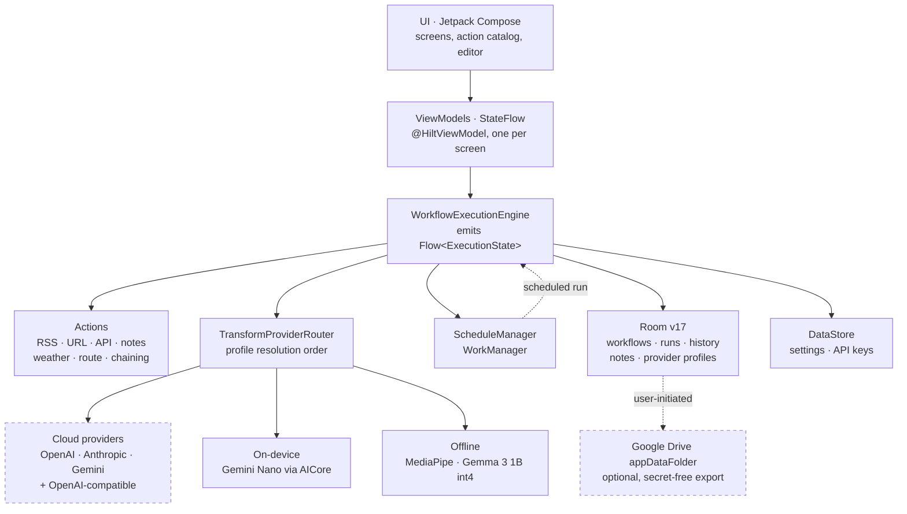

<p align="center">
  
</p>

<h1 align="center">Automatist</h1>

<p align="center">
  <strong>Mobile-first AI automation for Android.</strong><br>
  Useful AI workflows from the phone you already carry. No server, no homelab, no always-on laptop.
</p>

<p align="center">
  Free • Open source • No ads • No subscriptions • No feature paywalls
</p>

<p align="center">
  <a href="https://github.com/atj393/automatist-android/actions/workflows/ci.yml"></a>
  <a href="https://play.google.com/store/apps/details?id=com.automatist.app"></a>
  <a href="LICENSE"></a>
  
  
  
  
</p>

<p align="center">
https://github.com/user-attachments/assets/8ab75fc6-6c31-4c78-a346-386a945723ed
</p>

---

## Project status

- **Source:** open source under **Apache-2.0**, in active development.
- **Google Play:** [available on the Google Play Store](https://play.google.com/store/apps/details?id=com.automatist.app), or build from source (see [Build from source](#build-from-source)).
- **On-device AI:** availability depends on your device. See [Cloud, on-device and offline AI](#cloud-on-device-and-offline-ai).
- **Current release:** `1.1.2` (versionCode 9). See the [changelog](CHANGELOG.md) and [releases](https://github.com/atj393/automatist-android/releases).
- **CI:** every push and pull request runs unit tests, Android Lint, and a debug build. See [Testing](#testing).

## Why Automatist

Automatist turns the Android phone you already own into a small runner for recurring AI tasks. No cloud account to create, no server to host, no subscription to pay.

- **Automate recurring AI tasks** such as summaries, briefs, social posts, and digests, on a schedule.
- **Combine sources:** articles, RSS feeds, URLs, REST APIs, saved notes, weather, and routes, then hand the result to AI.
- **No backend.** Everything runs on your device. There is no Automatist server that receives your content.
- **Your AI, your keys.** Bring your own cloud-provider keys, or run fully on-device with no key and no network.
- **You stay in control.** Every workflow produces a concrete artifact you review before copying, sharing, or saving. Nothing is auto-posted.

## What you can build

Pick a template or start from an empty canvas, chain reusable actions, add AI instructions, then run it manually or on a schedule.

- **Morning Brief:** summarize your RSS feeds into a daily digest.
- **Article Transformer:** turn any article or shared text into a summary, thread, or professional post.
- **Meeting Strategist:** turn meeting notes into a brief with action items or strategic questions.
- **News to Social Posts:** fetch news and generate platform-tailored posts.
- **Morning Commute Brief:** combine weather, travel time, and headlines before you leave.
- **Custom:** a stock or flight tracker assembled from the REST-API action, or anything you build from the action catalog.

> Some actions require your own keys (AI providers, weather and route services), and some AI options require a compatible device or a one-time model download. Automatist does not bundle or pay for third-party services.

## Core capabilities

- **Workflow builder** with 11 action types: fetch URL, RSS, multi-RSS, REST API (GET), saved notes, previous-run output, another action's output, weather, route time, mid-workflow AI pass, and pass-through text.
- **Templates and blank canvas**, plus secret-free workflow import and export.
- **Scheduling:** manual, daily, weekly, or interval, via Android WorkManager.
- **Provider profiles:** named provider and model configurations, assignable per workflow.
- **Transparent run logs:** stage-by-stage progress, estimated token usage, duration, and error details.
- **Optional Google Drive sync:** back up workflow definitions to your own private Drive app folder.

## Screenshots

<p align="center">
  
  
  
  
</p>

## Cloud, on-device and offline AI

| Mode | Providers / models | Where your prompt goes |
|---|---|---|
| **Cloud** | OpenAI, Anthropic, Google Gemini, or any user-configured OpenAI-compatible endpoint | Sent **directly** to the provider you choose, using **your** API key |
| **On-device (system)** | Gemini Nano via Android AICore | Stays on the device. Requires a supported device and Android version |
| **Offline (downloadable)** | Compatible MediaPipe `.task` models: built-in Gemma 3 1B (int4), or a model you add | Stays on the device after a one-time download |

- Downloaded models are integrity-checked with **SHA-256**. For on-device and offline inference, **prompts never leave the device**. The model host only ever receives a file-download request.
- **`.gguf` and `.safetensors` are not supported** by the MediaPipe runtime, and not every model on Hugging Face is compatible. Only MediaPipe `.task` language models work. See [docs/local-model-import.md](docs/local-model-import.md).
- On-device availability and performance vary by device. Nothing is guaranteed.

## Privacy and data ownership

- **No Automatist backend, no analytics, no tracking, no ads, no billing.**
- Cloud AI: your text goes **directly** to the provider you select, authenticated with your own key.
- On-device and offline AI: prompts stay on the device.
- External workflow requests (URLs, RSS, REST APIs, weather, routes) go only to the services **you** configure.
- Google Drive sync is **optional** and uses your private `appDataFolder`. The developer cannot access it.
- API keys are stored **encrypted at rest** on the device, in `EncryptedSharedPreferences` behind an Android Keystore AES256-GCM master key. Backup and data-extraction rules exclude them, so keys are never carried into cloud backup or device-to-device transfer.

See the [privacy policy draft](docs/legal/privacy-policy-draft.md), pending publication at `automatist.cloud/privacy`.

## Quick start

For everyday use:

1. **[Get it on Google Play](https://play.google.com/store/apps/details?id=com.automatist.app)**, or build and install from source (see below).
2. In **Settings**, choose **on-device AI** (no key needed) or add a **cloud provider** API key.
3. Open **Templates → Use Template**, or start from an empty workflow.
4. Add actions and an output instruction.
5. **Run** it once, or set a **schedule**.
6. Review the result and the run log.

## Build from source

```bash
git clone https://github.com/atj393/automatist-android.git
cd automatist-android
```

**Requirements:** Android Studio (latest stable), JDK 17, Android SDK (compileSdk and targetSdk 36, minSdk 26).

Create a `local.properties` file (gitignored) pointing at your SDK:

```properties
sdk.dir=/path/to/your/Android/Sdk
```

Build, test, and lint:

```bash
./gradlew :app:assembleDebug        # build the debug APK
./gradlew :app:testDebugUnitTest    # run unit tests
./gradlew :app:lintDebug            # run Android lint
./gradlew :app:assembleRelease      # release APK (requires your own keystore.properties)
```

Release signing reads `keystore.properties` (gitignored). See `keystore.properties.example`. **Never commit signing credentials, keystores, or API keys.**

### Forking

Automatist is Apache-2.0, so forks are welcome. If you publish a fork:

- Use a different **`applicationId`**, not `com.automatist.app`.
- Configure your **own Google OAuth client** (your package name plus signing-cert SHA-1) and enable the Drive API if you want cloud sync. See the [release checklist](docs/release/google-play-release-checklist.md).
- Use your **own signing key** and **branding**. See [TRADEMARKS.md](TRADEMARKS.md).

## Supported providers and model formats

- **Cloud:** OpenAI, Anthropic, Google Gemini, and any OpenAI-compatible endpoint you configure with your own base URL and key.
- **On-device:** Gemini Nano (Android AICore) on supported devices.
- **Offline:** MediaPipe `.task` LLMs, either the built-in Gemma 3 1B (int4) or a compatible model you add via URL or a JSON manifest (HTTPS-only, SHA-256-verified). `.gguf` and `.safetensors` are **not** supported.

## Scheduling and Android limitations

Schedules run through **WorkManager**. Android **Doze** and aggressive **OEM battery management** can **delay** background runs, sometimes by minutes or more. Automatist does **not** promise exact-time execution, and the UI shows both the computed next run and the actual last run so the gap is visible rather than mysterious.

## Architecture

Single-activity Jetpack Compose app, MVVM with Hilt, and no backend of any kind. The
defining boundary is the provider router: everything above it is provider-agnostic, so a
workflow does not know or care whether its text is transformed in a datacentre or on the
phone's own NPU.



Dashed nodes are the only two places data can leave the device, and both are opt-in: a cloud
provider you configured with your own key, and a backup you trigger yourself.

- **Room** (database version 17, 16 hand-written migrations) for history, workflows, notes, and provider profiles. **DataStore** for settings and keys.
- **WorkManager** for scheduled and background execution. **Retrofit** and **OkHttp** for network calls, with HTTPS enforced.
- **Hilt** wires the graph across 8 modules.
- The router resolves provider and model in a fixed order: explicit `profileId` on the input, then the default profile row, then the legacy `activeProvider` setting.

## Engineering challenges

The interesting problems in this codebase were not the UI. They were the consequences of
running a multi-gigabyte language model inside an app that also has to survive Doze.

**1. Oversized prompts crashed the process, not the coroutine.**
MediaPipe's LLM inference runs through JNI. Handing it a prompt longer than the model's
context does not throw a catchable Kotlin exception. It aborts the native runtime with
SIGABRT and takes the whole process with it, so a `try/catch` is useless. The fix is a preflight
budget enforced *before* the native call: `MAX_TOTAL_TOKENS = 1536`, split into a
`MAX_INPUT_TOKENS = 1280` ceiling and a `MIN_OUTPUT_RESERVE_TOKENS = 256` reserve, with
`LocalPromptBuilder` truncating at the character level against the catalogue's
`contextWindowChars` before the estimator ever runs. Two independent guards, because the
failure mode is unrecoverable.

**2. Concurrent inference tried to allocate the model twice.**
The offline model is roughly 529 MB on disk and several gigabytes resident. Two workflow runs
overlapping, which is easy to trigger with two schedules on the same hour, meant two simultaneous
loads and an OOM kill. Inference is pinned to a single dedicated `MediaPipe-Worker` thread
rather than the shared IO dispatcher, which serialises calls by construction instead of by
lock discipline. The model is also *not* cached between calls: holding 2 to 3 GB resident so the
next run starts faster is exactly the thing that gets a background app killed.

**3. R8 obfuscation broke JNI at runtime, not at build time.**
MediaPipe and AICore resolve classes by name across the native boundary. Minified release
builds compiled and installed perfectly, then crashed on first inference. The keep rules in
`proguard-rules.pro` are load-bearing, and the failure they prevent is invisible to CI that
only builds debug.

**4. Scheduling on Android is a negotiation, not a guarantee.**
WorkManager plus Doze plus OEM battery management means a "07:00 daily" workflow may run at
07:00, or at 07:40, or when the user next unlocks. The app states this plainly rather than
implying precision it cannot deliver, and surfaces computed "next run" and actual "last run"
so the gap is visible.

**5. Model IDs became a migration surface.**
`gemma-3n-e2b` is stored in user `ProviderProfile` rows and DataStore keys. Once shipped, it
is frozen: the display name was later corrected to "Gemma 3 1B (int4)" but renaming the ID
would silently break every existing install's provider selection. The same applies to the
`offline-models-v1` release tag and its SHA-256. They are download trust anchors baked into
shipped clients, not implementation details.

## Design decisions

| Decision | Alternatives considered | Why this one |
|---|---|---|
| **No backend at all** | Thin proxy for key management and shared history | A proxy is the single most valuable thing to attack and the one thing that turns "your data" into "my liability". No server means no breach surface, no hosting cost, and no reason for the project to ever need a subscription. |
| **Bring-your-own API key** | Bundled or pooled provider key | A bundled key forces metering, accounts, and a paywall, and puts my credentials behind someone else's workload. User keys keep the app free and the trust boundary honest. |
| **Router behind one interface** | Per-provider branches at each call site | `ArticleTransformProvider` has one method. Adding a provider touches the catalogue and one routing case, not every screen. It is also what makes cloud and on-device genuinely interchangeable. |
| **Room and DataStore, not one store** | Everything in Room, or everything in DataStore | Relational data with foreign keys and cascade deletes (workflows to runs) belongs in Room. Scalar settings and keys do not need migrations to change. |
| **Preflight token guard** | Catch the failure and retry smaller | Not available. The failure is a native abort, so there is nothing to catch. The guard has to be ahead of the call. |
| **Load the model per call** | Keep it warm between runs | Warm is faster and gets the process killed. Cold start is the price of surviving in the background. |
| **Manual final action** | Auto-post to the selected platforms | Every workflow ends at a reviewable artifact. Auto-posting is the feature that turns a useful tool into a spam engine, and it is deliberately absent. |

### Why these technologies

- **Kotlin and Compose:** a single-developer codebase benefits disproportionately from one
  language across UI, domain, and workers, and from UI that is a function of state when that
  state arrives from a long-running background job.
- **Hilt:** the router needs to inject a different provider implementation per profile at
  runtime, and hand-rolled factories for that get unpleasant fast.
- **WorkManager:** the only scheduling API on Android that survives reboots and Doze
  transitions without a foreground service the app does not need.
- **MediaPipe and AICore:** the two runtimes that actually run an LLM on a phone today, with
  different device floors (API 26 and 3 GB RAM versus API 34 on recent flagships), which is why the
  catalogue drives dispatch rather than a hardcoded branch.

## Testing

**39 JVM test classes, 407 test methods**, run on every push and pull request. There is no
instrumented (`androidTest`) suite. The logic worth protecting was deliberately kept out of
Android framework classes so it could be tested on the JVM.

What is covered, and why it was worth covering:

| Area | What the tests pin down |
|---|---|
| Token budgeting | Oversized prompts are rejected *before* the native call, which is the SIGABRT guard |
| Prompt construction | Truncation against the context window, per-provider system prompts |
| Provider routing | Profile resolution order, and that model overrides reach the concrete provider |
| Workflow engine | Stage transitions, per-stage reset, elapsed-time accounting, auto-retry |
| Offline model catalogue | Manifest parsing, custom-model validation, SHA-256 expectations |
| First-run seeding | Idempotency across relaunches, and never overwriting a user's default profile |
| Readiness | Which actions are blocked, and the exact missing requirement reported |
| Removed paid tier | Regression tests asserting billing and Pro UI stay gone |

Not covered, deliberately: real network calls to AI providers (fakes instead), real MediaPipe
inference (needs a device and multiple gigabytes), and Compose UI rendering.

```bash
./gradlew testDebugUnitTest    # what CI runs
./gradlew lintDebug
./gradlew assembleDebug
```

## Documentation

- [CONTRIBUTING.md](CONTRIBUTING.md) · [SECURITY.md](SECURITY.md) · [SUPPORT.md](SUPPORT.md) · [CODE_OF_CONDUCT.md](CODE_OF_CONDUCT.md) · [CHANGELOG.md](CHANGELOG.md)
- [LICENSE](LICENSE) · [NOTICE](NOTICE) · [TRADEMARKS.md](TRADEMARKS.md) · [THIRD_PARTY_NOTICES.md](THIRD_PARTY_NOTICES.md)
- [Architecture decision records](docs/architecture/): why there is no backend, how provider routing works,
  why scheduling is approximate, and how the offline token budget prevents a native crash.
- [Local model import](docs/local-model-import.md) · [Privacy policy (draft)](docs/legal/privacy-policy-draft.md)

## Contributing

Contributions are welcome. See [CONTRIBUTING.md](CONTRIBUTING.md) for setup, build and test commands, and PR expectations (no secrets or model binaries in PRs), and the [Code of Conduct](CODE_OF_CONDUCT.md).

## Security

Secrets are held in `EncryptedSharedPreferences` with a master key generated in the Android Keystore, and the backup and data-extraction rules exclude both the encrypted preferences file and the DataStore directory.

Please report vulnerabilities privately. See [SECURITY.md](SECURITY.md). Do not open a public issue for security problems.

## Support

Automatist is free and open source. Use **GitHub Issues** for bugs and feature requests on [atj393/automatist-android](https://github.com/atj393/automatist-android/issues). For private matters see [SUPPORT.md](SUPPORT.md).

## License and branding

- **First-party source code:** [Apache License 2.0](LICENSE), Copyright © 2026 Alexis Johnson (see [NOTICE](NOTICE)).
- **Third-party dependencies:** their own upstream licences. See [THIRD_PARTY_NOTICES.md](THIRD_PARTY_NOTICES.md).
- **AI model weights** such as Gemma, downloaded at runtime: their upstream model terms, including the [Gemma Terms of Use](https://ai.google.dev/gemma/terms) and [Prohibited Use Policy](https://ai.google.dev/gemma/prohibited_use_policy).
- **Branding:** the Automatist name, logo, launcher icon, and store artwork are **not** granted by the code licence. See [TRADEMARKS.md](TRADEMARKS.md).

"Android", "Google Play", "Gemma", and "Gemini" are trademarks of Google LLC. Automatist is an independent project and is not affiliated with, endorsed by, or sponsored by Google LLC.
